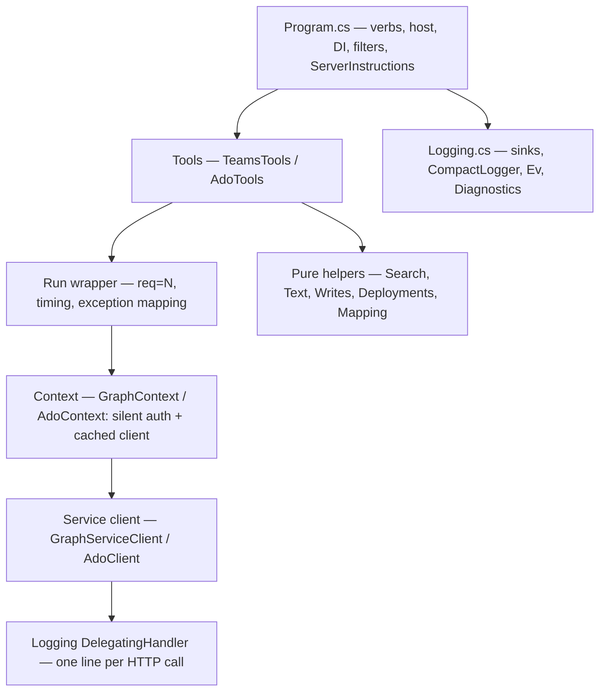

# Architecture

Two .NET 10 console applications, each an MCP **stdio** server built on the official
[ModelContextProtocol](https://www.nuget.org/packages/ModelContextProtocol) C# SDK, pinned at
**2.0.0** (protocol revision 2026-07-28, negotiating down to 2025-11-25 and 2024-11-05).

| Project | Command | Talks to | Client |
| --- | --- | --- | --- |
| `src/TeamsMcp` | `teams-mcp` | Microsoft Graph | `GraphServiceClient` (Kiota-generated SDK) |
| `src/AzureDevOpsMcp` | `ado-mcp` | Azure DevOps REST | `AdoClient`, a hand-rolled typed `HttpClient` wrapper |

Each has a test project under `tests/`; all four are in `McpServers.slnx`.

## The servers share no code, on purpose

`Logging.cs` is near-identical between them. `Run`, `ToolListing`, `ToolResults`, the DTO style and
`Install.cs` are parallel. That duplication is a decision, not drift.

The rule: **do not extract a common library on the strength of the similarity alone.** The plan is
to factor one out when a third consumer or a real divergence forces the question. Until then a
change to a shared convention means changing it in both places, and a new server means copying the
conventions again.

The one scheduled exception is `ToolListing.cs`, whose two copies change for the same external
reason — a protocol revision — rather than for their services: it extracts into a shared project
the next time a revision forces an edit to both copies, in that same change.

The reason is that the two are independent processes with independent failure modes, independent
release-blocking risk, and different service semantics underneath a superficially identical shape.
A shared library would couple their release cadence and would have to grow a seam for every place
Graph and Azure DevOps differ, which is most of them below the top layer.

## Layers within one server

- **`Program.cs` is composition only.** Verb dispatch, logger providers, DI registration, the
  serializer options, the server instructions, the Tasks extension, and the two request filters.
  It contains no service logic.
- **The tool class is the MCP surface.** One `[McpServerToolType]` class per server, discovered by
  `WithToolsFromAssembly`. Nothing is registered at runtime, which is what lets `tools/list` be
  advertised as cacheable (see [tool-contract.md](tool-contract.md)).
- **The context owns authentication and the client.** Registered as a singleton; builds its client
  lazily behind a `SemaphoreSlim`, acquires a token up front so an auth failure is reported as one,
  and never prompts.
- **Pure helpers hold everything testable.** Query construction, body conversion, mapping, patch
  documents, cursor encoding. They are `internal` and reached from the test project through
  `InternalsVisibleTo` — prefer widening to `internal` over reshaping code for testability.

## The life of a tool call

1. The client sends `tools/call`. The SDK deserializes arguments onto the method's parameters.
2. `AddCallToolFilter` wraps the invocation (its work happens on the way out).
3. The tool body calls `Run(name, args, …)`, which allocates the next `req=N`, stashes it in an
   `AsyncLocal`, logs `tool.start` with the arguments, and starts a stopwatch.
4. The body calls `context.GetClientAsync(ct)`. First call per process: read the authentication
   record, acquire a token silently, build the client. Later calls return the cached instance.
5. Names are resolved to ids, the service is called (possibly in a paging loop or a poll loop), and
   wire types are mapped to DTOs.
6. `Run` logs `tool.ok` with a result summary, or maps the exception to an `McpException` and logs
   `tool.fail`.
7. The SDK serializes the DTO with `DefaultIgnoreCondition = WhenWritingNull`, filling both
   `content` and `structuredContent`; `ToolResults.Trim` drops the duplicated text copy.

Every HTTP request the call made carries the same `req=N`, because the correlation id is stamped by
the logger from the `AsyncLocal` rather than passed down. That is what makes a failure
reconstructible from the log file alone.

## Process modes

Both `Program.cs` files dispatch on `args[0]` **before** building the host. Those branches return
early, so they may write to stdout freely; server mode may not.

| Mode | Teams | Azure DevOps | Writes stdout |
| --- | --- | --- | --- |
| `install` | yes | yes | yes |
| `auth` | yes | yes | yes |
| `selftest` | yes | yes | yes |
| `config` | — | yes | yes |
| *(no argument)* — MCP server on stdio | yes | yes | **never** |

**stdout belongs to the MCP transport.** In server mode the default logging providers are cleared
and two `CompactLoggerProvider`s are registered — a file sink and a **stderr** sink. A
`Console.WriteLine`, a stdout sink or an `AddConsole()` on any path reachable from server mode
corrupts the JSON-RPC stream.

## File map

### `src/TeamsMcp`

| File | Holds |
| --- | --- |
| `Program.cs` | Verbs, host, DI, `ServerInstructions`, Tasks, the two request filters, crash handlers |
| `GraphContext.cs` | Scope lists and the send gate, interactive and silent auth, `ScopeConsent`, `GraphLoggingHandler` |
| `TeamsTools.cs` | Every tool, the message pager, the wait loop, watermarks and cursors, `Run`, HTML→text, the DTOs |
| `Search.cs` | KQL construction and the untyped mapping of a Microsoft Search hit |
| `ToolListing.cs` | `ToolExecution.LongRunning`, `ToolResults.Trim`, `ToolListing.Stamp` |
| `Logging.cs` | `TeamsMcpLog`, `Diagnostics`, `Ev`, the sinks and `CompactLogger` |
| `Install.cs` | The `install` verb: repository discovery, client detection, config merge |

### `src/AzureDevOpsMcp`

| File | Holds |
| --- | --- |
| `Program.cs` | Verbs (including `config`), host, DI, `ServerInstructions`, Tasks, filters, crash handlers |
| `AdoContext.cs` | Resource id and scopes, auth, `BearerTokenHandler`, `AdoLoggingHandler`, `AdoApiException`, `AdoClient` |
| `AdoTools.cs` | Every tool, `deployment_status`' chains, `Run`, WIQL construction, `Resolve` and the resolvers, list/paging helpers |
| `AdoModels.cs` | Wire types and `Mapping` — the wire→DTO layer and the output DTOs |
| `Writes.cs` | JSON Patch documents, the parent relation, tag merging, identity plumbing |
| `Deployments.cs` | The deployment map's shape and validation, the vsrm host, TFVC mapping parsing, path containment |
| `DataFiles.cs` | `DataFile<T>`: the one mechanism for externally configured data |
| `Search.cs` | The almsearch host and the shared search request body |
| `Text.cs` | HTML and Markdown to plain text, truncation |
| `ToolListing.cs`, `Logging.cs`, `Install.cs` | As above |

## State and concurrency

Everything a server holds is per process and dies with it. There is no database, no shared cache
between the two servers, and nothing persisted except the auth material and the log.

| State | Where | Guarded by |
| --- | --- | --- |
| The service client | `GraphContext._client` / `AdoContext._client`, singleton | `SemaphoreSlim` with a double-check |
| The bearer token (Azure DevOps only) | `BearerTokenHandler._token` | `volatile` immutable record for the lock-free read, `SemaphoreSlim` for the refresh |
| The `req=N` counter | `static int _sequence` in each tool class | `Interlocked.Increment` |
| The in-flight `req=N` | `AsyncLocal<string?>` in `…McpLog` | Ambient per async flow; `Run` saves and restores the previous value |
| Data files | `DataFile<T>._cache` | `Lock`; re-parsed when the file's timestamp changes |
| Task handles for the waiters | `InMemoryMcpTaskStore` | The SDK; correct for stdio, where the store dies with the client |
| The log file handle | `FileLineSink._stream` | `Lock`; opened `FileShare.ReadWrite` so several processes can append |

Tool calls can be concurrent. Nothing in either server assumes otherwise: the tools are stateless
methods over an immutable client, and the shared mutable state is the table above.

## Cross-cutting invariants

These hold across both servers. A change that breaks one will be asked to change.

- **stdout belongs to the MCP transport** (above).
- **Mutations are opt-in per environment.** `TEAMS_MCP_ALLOW_SEND` and `ADO_MCP_ALLOW_WRITE`. A new
  mutating tool calls the existing gate helper — `TeamsTools.RequireSendEnabled` /
  `AdoTools.RequireWriteEnabled` — before anything else, including argument validation, and repeats
  the variable's name in its own `[Description]`. Gates are never written into a repository's
  config by `install`.
- **User-authored content is not logged by default.** `ContentArg` for message bodies, descriptions
  and comments; plain `Arg` for ids, counts, flags and addresses. See
  [observability.md](observability.md).
- **Organization-specific knowledge is configuration, never code.** No tag name, TFVC path, release
  definition or per-organization heuristic belongs in this repository. Extend the mechanism and put
  the facts in an external data file. `DataFile<T>` is that mechanism.
- **Output is shaped for a model's context window.** Nulls omitted, uninteresting fields nulled,
  filtered items counted rather than dropped, `snake_case` parameter names. See
  [tool-contract.md](tool-contract.md).

## Testing boundary

`dotnet test` covers everything that does not need the remote service: body conversion and
truncation, DTO mapping and skip counting, name resolution, WIQL and KQL construction, cursor
encoding, the auth and consent logic, the logging stack, the `tools/list` hints and result
trimming, the tool annotations, and all of `install`. Read `tests/` for the current inventory.

Three test files are worth knowing about because they enforce conventions rather than behaviour:

- `ToolListingTests` — every tool declares either `ReadOnly` or a mutation hint, every name in
  `ToolExecution.LongRunning` is a tool that exists, and the listing is stamped and sorted.
- `ToolOutputShapeTests` — the null-omitting serializer contract.
- `ToolRunTests` — the `Run` wrapper's exception mapping and log lines.

Anything that talks to Graph or Azure DevOps is verified by hand. `-- selftest` exercises the same
silent credential path each server uses, but in console mode where exceptions and output are
visible. Verifying a tool change end to end means registering the server in an MCP client and
calling it, or temporarily extending the `selftest` branch. `scripts/rebuild.ps1` is the inner loop
for that.

## Extending

**Adding a tool.** Put it on the existing tool class with `[McpServerTool]` +
`[Description]`; set `UseStructuredContent = true` and either `ReadOnly = true` or the mutation
hints; wrap the body in `Run(name, A(…) + …, async () => …)`; return a DTO whose uninteresting
fields are nullable and nulled. If it mutates, call the gate helper first. The checklist is in
[tool-contract.md](tool-contract.md#checklist-for-a-new-tool).

**Adding a Graph capability.** Add the scope to `GraphContext.ReadScopes` *and* the app
registration's delegated permissions, then re-run `-- auth` to re-consent. See
[authentication.md](authentication.md).

**Adding an Azure DevOps capability.** There is no scope list to extend — it is a single
`…/.default` resource scope. A new capability means a new delegated permission on the app
registration, possibly an organization policy change, then `-- auth` again.

**Adding externally configured data.** A new `DataFile<T>` with its environment variable, default
file name and format hint, plus a section in the `-- config` verb so the data can be validated
without driving the tools through an MCP client.

**Adding a server.** Copy the conventions rather than extracting them (above), give it its own
`…_TENANT_ID` / `…_CLIENT_ID` pair, its own cache name and log file, and add it to `McpServers.slnx`,
the plugin's `.mcp.json`, and the release workflow. The `mcp-release` skill covers the packaging
side.
